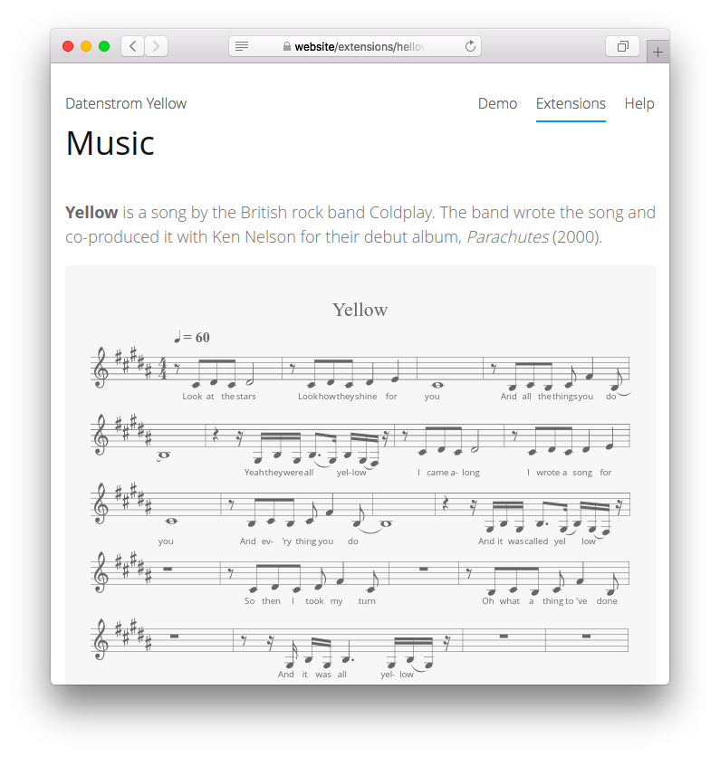

Music 0.8.18
============
Music scores.

<p align="center"></p>

## How to install an extension

[Download ZIP file](https://github.com/GiovanniSalmeri/yellow-music/archive/refs/heads/main.zip) and copy it into your `system/extensions` folder. [Learn more about extensions](https://github.com/annaesvensson/yellow-update).

## How to show a music score

You can write a music score with [ABC notation](https://abcnotation.com/). ABC is a format that allows to write easily both simple and complex musical scores, even without a graphical editor. The library used has [a few minor differences](https://paulrosen.github.io/abcjs/overview/abc-notation.html) from ABC standard.

Insert the music score with a code block. Wrap the data in \`\`\` and add the language identifier `music`.

## Examples

A simple musical score in ABC notation:

    ``` music
    X: 1
    T: Yellow
    Q: 1/4=60
    M: 4/4
    L: 1/8
    K: B
    %%vocalfont Open Sans 9
    z CDC D4 | z CDC D2 E2 | C8 | B,CB, C F2 (B, | 
    w: Look at the stars | Look how they shine for you | And all the things you do
    B,8) | z2 z/ G,/B,/G,/ (B,>G,) B,/(G,/F,/) z/| z CDC D4 | 
    w: | Yeah they were all* yel-low* | I came a-long
    CDC D2 E2 | C8 | B,CB, C F2 (B, | B,8) | 
    w: I wrote a song for | you | And ev-'ry thing you do*
    z2 z/ G,/B,/G,/ B,>(G, B,/)(G,/F,/) z/| z8 | z CDC D F2 C | z8 | 
    w: And it was called yel*low* | So then I took my turn
    z B,CB, C F2 B, | z8 | z z/ G,/ B,/G,/ B,3 G,/(B,/G,/) z/ | z8 | z8 | 
    w: Oh what a thing to~'ve done | And it was all yel-low*
    z2 B,2(G3F) | z B,B,F FD D2 | z2 B,2(G3F) | z B,B,F FD D2 | 
    w: Your skin* | Oh yeah your skin and bones | Turn in-* | to some-thing beau-ti-ful
    z2 B,2(G3F) | z B,B,F FD (D2 | G,8) | z B,B,F FD (D2 | F,8) |
    w: You know* You know I love you so* You know I love you so*
    ```

## Settings

The following setting can be configured in file `system/extensions/yellow-system.ini`:

`MusicReflow` = reflow the score according to the space available (intead of resizing it)  

## Acknowledgements

This extension includes [abcjs 6.0.0](https://paulrosen.github.io/abcjs/) by Paul Rosen and Gregory Dyke. Thank you for the good work.

## Developer

Giovanni Salmeri. [Get help](https://datenstrom.se/yellow/help/).
